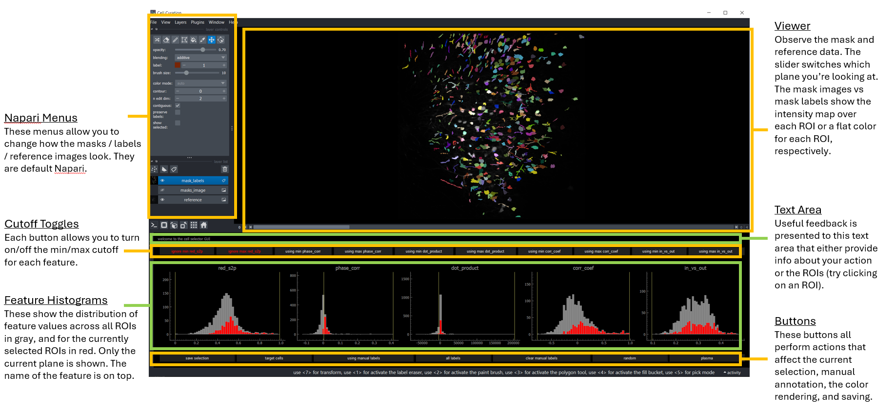

# How to use the GUI
This is a short explanation of how to use the GUI. There will be more explanations later,
but for now this is just to get people started with the basic functionality. 

## Components
The GUI has several components, indicated on the image displayed above. 

#### Napari viewer
This is a standard napari app (you can look at the documentation for it on napari's 
website). There are three layers displayed:
1. Mask images, which are a rendering of the mask intensity data - e.g. "lam" from suite2p
2. Mask labels, which are a flat color rendering for each mask. In random color mode, each
mask get assigned a random color. In feature mapping modes (try pressing the "c" key),
they map each label to it's value in one of the features displayed below. The colormap can
be changed with the colormap button (or by pressing the "a" key). 
3. Reference image, which is a graymap intensity image of the reference fluorescence. You
can turn this on or off by pressing the "r" key. 

You can turn off the masks (images or labels) by pressing the "v" key. 
You can turn off the reference by pressing the "r" key. 
You can switch between mask images and labels by pressing the "s" key. 
You can switch between displaying selected ROIs and control ROIs with the "t" key. 

The slider below the viewer area controls which plane is being observed.

#### Information Bar
Immediately below the viewer is a little text area which displays useful information and
feedback to the user. 

#### Feature Cutoff Toggles
Each feature is associated with a minimum and maximum cutoff (the two vertical yellow
lines on each histogram). You can turn on or off the cutoff by pressing the button above
each histogram. The text on the button indicates whether the cutoff is being used. If a
cutoff isn't used, then the saved value will be ``None``.

#### Feature histograms
These show the distribution of feature values for all the ROIs in the current plane for 
each feature. The name of the feature is above the histogram. The full distribution is 
shown in gray, and the currently selected ROIs is shown in red. 

#### Buttons
There are a few buttons which control the GUI. They're all explained below. Some of them
are controlled by key strokes. 

## Key strokes
t: toggle control vs target cells in selection

s: switch between mask images and mask labels

v: turn on/off the visibility of masks

r: turn on/off the visibility of the reference

c: go to next color state (i.e. random, or pseudocoloring each label by its feature value)

a: change colormap (only applies if not in random color state)

control-c: save selection (this will save the target cells - not the currently selected 
cells, so if you are currently showing control cells, it'll always save control cells).

## Buttons
save_selection: saves the target cells and all the data (features, feature cutoffs "criteria", 
target idx). Note, this will always save the target cells, not the currently selected cells,
so if you are currently showing control cells, it'll still just show the target ones. 

